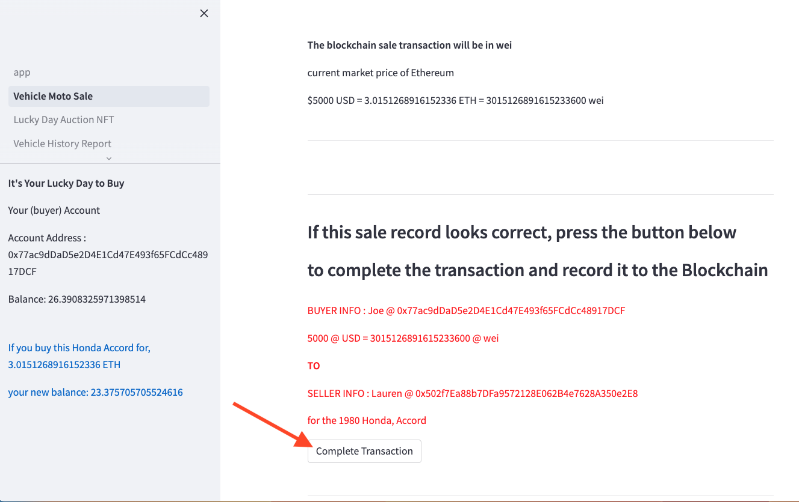

# lucky_day

---

## Blockchain Buy/Sell App

This project utilizes a Streamlit app to handle private and public blockchain sales transactions. 

Private transactions of vehicle/motorcycle sales can be handled with user input data to complete the sale via a simple blockchain wei transaction or using a smart contract for tokenization of the VIN and tracking of all transactions with that token in addition to the monetary transaction.

A second functionality of the app interface uses a smart contract, using ERC721 standards, to tokenize artwork NFTs and handle the sale/auctioning of those tokens via a public blockchain network. 

The python code in this project leverages the program Ganache to connect the user's(buyer's) crypto wallet to the Streamlit interface. The user can choose a page for which type of transaction they wish to use: buying a vehicle/motorcycle or selling/auctioning their art assets.  

## Blockchain Vehicle History Report

LuckyDay Vehicle History Report is a part of the LuckyDay web app , for storing vehicle history records on the blockchain. Right now the vehicle history records are distributed among dealers, insurance companies, collision centers, and DMVs etc. The main purpose of the LuckyDay Vehicle History report is to bring all scattered records to one place and give a role based access to different parties to add the different history records in the LuckyDay blockchain. For example: the records for emission tests , repair works, Oil changes etc. can be added to the blockchain by different parties and can not be altered later. The successive buyer will have unaltered and complete history of the vehicle before buying it. 


---

# Technologies
python 3.8

Web3 5.17

mnemonic 0.20

bip44 0.1.3

os-sys 2.1.4

python-dotenv 0.21.1

ethereum 2.3.2

solidity 0.8.1

https://trufflesuite.com/ganache/


# Install Lucky Day
1. Open your terminal and start a new dev env

    ```
    `conda create -n dev python=3.8 anaconda`
    ```

2. Activate your dev envnironment
    ```
    `conda activate dev`
    ```

3. Install required Technologies in development environment
    ```
    pip install web3
    pip install mnemonic
    pip install bip44
    pip install os-sys
    pip install python-dotenv
    pip install ethereum
    ```

4. In the directory of your choice, clone this repository
    ```
    `git clone git@github.com:KausarHina/lucky_day_multipage.git`
    ```
5. Download Ganache to local system
    www.https://trufflesuite.com/ganache/
    
    - click on download to your local system
    
    - open Ganache using a Quick Start button
    
6. At top of the dasboard under the "Accounts" Tab, will be a mnemonic string

    

    - copy the string to your clipboard
    
7. Create a new .env file in your lucky_day cloned directory 

    open the IDE of your choice and navigate into the app folder, copy  `sample.env` in a new file

    enter following env values for your environment

    ```
    MNEMONIC=''
    VEHICLE_SMART_CONTRACT_ADDRESS=''
    ACCESSCONTROLS_SMART_CONTRACT_ADDRESS=''
    MOTHISTORY_SMART_CONTRACT_ADDRESS=''
    SERVICE_HISTORY_SMART_CONTRACT_ADDRESS=''
    WEB3_PROVIDER_URI='HTTP://127.0.0.1:7545'
    PINATA_API_KEY=''
    PINATA_SECRET_API_KEY=''
    JWT=''
    ```
    
    - save the file as simply '.env

    
    - 
    
    
    
    - **this mnemonic will be used in the `lucky_day.py` code to create a wallet with public and private key for you use on the local Ganache testing Blockchain**
    
8. Navigate to your Ganache Dashboard once again
    
    - your wallet and public address will be listed as the first address on the Ganache dashboard
    - the another address in the list will be your "Seller_Address" options
        -- as described below in step 5.
    
      
    

---

## Run lucky_day

1. Navigate to your terminal, then to the directory where you cloned the lucky_day repository
    ```
        - run `streamlit run app/app.py` 

        or 

        execute `./run.sh`
    ```   
2. Navigate to streamlit page running locally in browser window

3. In the sidebar menu, select the type of transaction you would like to conduct
    - "Vehicle Moto Sale"
    - "Lucky Day Auction NFT"
    - "Vehicle History Report"
    
       

4. You will be directed to your page of choice.

---

## Vehicle / Motorcycle Sale
1. Enter the data appropriate for the sale type, and choose whether you wish to have the transaction remain a 'Simple       Blockchain Transaction' where only the wei transaction and the addresses of buyer and seller will be recorded, or if "Smart Contract Enabled" is your preferance, where a token is created for your VIN and all sale transaction information is recorded to your vin/token.

2. Hit the "Transaction Type" button, to register your preferences.

     

3. An expandable menu will appear. Click the "Customize Your Transaction" button.
    
         
    
4. Enter the specific information about the vehicle or motorcycle you are buying, the seller name and address, and enter your name, and gas for the transaction.

    
     
     

5. Hit the "Review Transaction Details" button on the bottom of the expander
        - the current USD to ETH to wei equivalents are listed
        - the details you entered about the transaction are listed as a transaction record for final review
    
     
    
6. Hit the "Complete Transaction" button on the bottom of the expander
    -see the transactions hash code printed below the button verifying the hash code added to the block as the transaction was processed. Your new wallet balance will appear on the sidebar.
      

7. You can verify this transaction by navigating to your Ganache dashboard and clicking on the "Transactions" tab

    

    

8. The amount paid will also be subtracted from your wallet balance, listed next to your wallet address on the "Accounts" page
    - (you can also see the transaction price added to the seller's Address that you listed in the app because for this beta version the seller addresses are in your Ganache test network)

    


## Vehicle History Report 

1. Follow the 'VehicleHistoryReport_SmartContracts_Setup.pdf' for detailed setting up steps

    

2. Follow the 'VehicleHistoryReport_UserGuide.pdf' for detailed user guide steps

    
---

# Contributors

Jodi Artman.  *github.com/Arty-j*

Kausar Hina.  *github.com/KausarHina*

Marissa Gonzalas.  *github.com/Marissagonzales468*

Edith Chou.   *github.com/wf880180*

---

# License

licensed in accordance with UC Berkeley policy